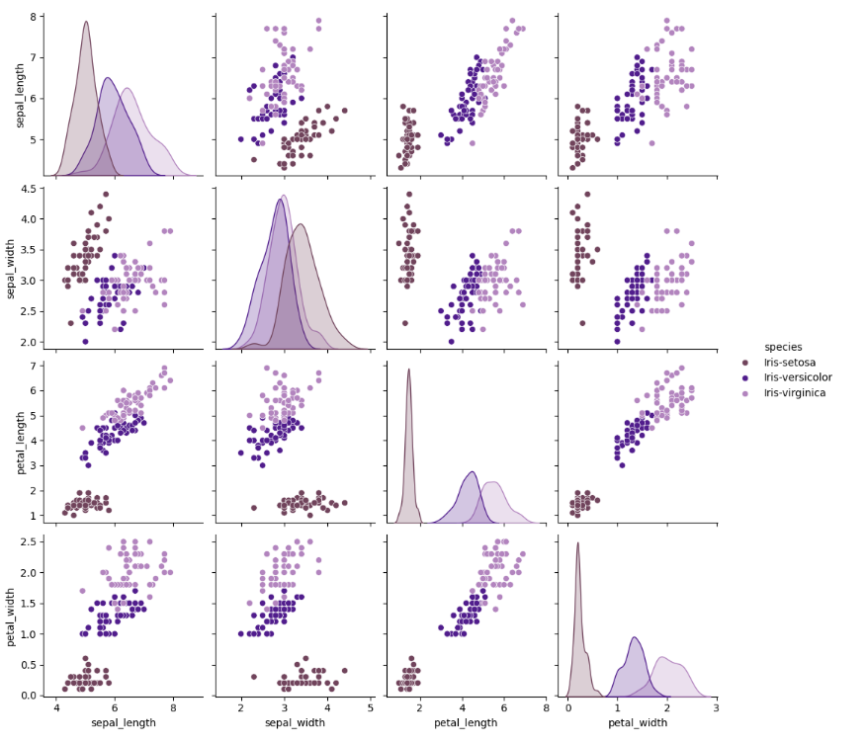
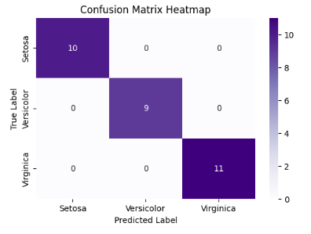
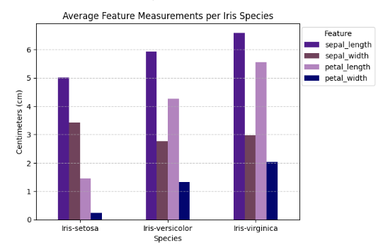

# 🪻 Iris Flower Classification

Classifying iris flower species using a feedforward neural network (MLP) built with Keras, achieving 100% accuracy across all three species.

---

## Overview

In 2025, I participated in MIT FutureMakers, a six-week program in collaboration with SureStart to teach students about data analysis, mobile app development, and deep learning. Our team completed three practice neural networks before creating a final capstone project; this was the first of the three networks that we created. The Iris dataset is a classic multiclass classification problem, but it served as our first exposure to how neural networks categorize data via supervised learning. The network learns to distinguish between three iris species based on four physical measurements, using batch normalization and dropout to prevent overfitting on the small dataset, and is trained for 50 epochs before determining the accuracy via graphs and reports.



---

## Dataset

- **Source:** [UCI Iris Dataset](https://archive.ics.uci.edu/dataset/53/iris) / scikit-learn built-in
- **Size:** 150 samples, 50 per species
- **Features:** Sepal length, sepal width, petal length, petal width
- **Target classes:** *Iris setosa*, *Iris versicolor*, *Iris virginica*

---

## Results

The model achieved **100% accuracy** on the test set (30 samples), with no misclassifications across any species.

### Confusion Matrix



### Classification Report

| Class | Precision | Recall | F1-Score | Support |
|---|---|---|---|---|
| Iris-setosa | 1.00 | 1.00 | 1.00 | 10 |
| Iris-versicolor | 1.00 | 1.00 | 1.00 | 9 |
| Iris-virginica | 1.00 | 1.00 | 1.00 | 11 |
| **Overall** | **1.00** | **1.00** | **1.00** | **30** |

---

## Key Takeaways

- Applying a neural network with **BatchNormalization and Dropout** to a small dataset (150 samples) successfully avoids overfitting.
   - If all of the neurons remained active for the full duration of training, it likely would have struggled with new, unseen data.
- The clean confusion matrix diagonal confirms the model learns **distinct decision boundaries** between all three species.
   - Iris versicolor and Iris virginica are typically cited as the hardest pair to separate, but no errors were made during testing.
- One-hot encoding can be better than using label encoding to prevent bias, ensuring the model doesn't assume there's a hierarchy.
   - In previous projects, I've used label encoding instead; potentially, this could have negatively impacted the results.
 


---

## Setup

### Prerequisites

```bash
pip install -r requirements.txt
```

### Running the Notebook

```bash
git clone https://github.com/eliasangelss/iris-flower.git
cd iris-flower
jupyter notebook model.ipynb
```

---

## Project Structure

```
iris-flower/
├── model.ipynb       # Includes analysis, modeling, evaluation, and my notes
├── irisData          # Folder containing the dataset
├── requirements.txt
└── README.md
```

---

## Model Architecture

```
Input (4 features)
  → Dense(16, ReLU) → BatchNormalization → Dropout(0.2)
  → Dense(8, ReLU)  → BatchNormalization → Dropout(0.2)
  → Dense(3, Softmax)   ← one output node per species
```

- **Train-Test Split:** 120 train / 30 test
- **Optimizer:** Adam (lr = 0.01)
- **Loss:** Categorical crossentropy
- **Regularization:** BatchNormalization + Dropout(0.2) on both hidden layers

---

## Tools & Libraries

- Python, Jupyter Notebook
- TensorFlow / Keras
- scikit-learn, pandas, NumPy
- matplotlib, seaborn

---

## License

MIT
